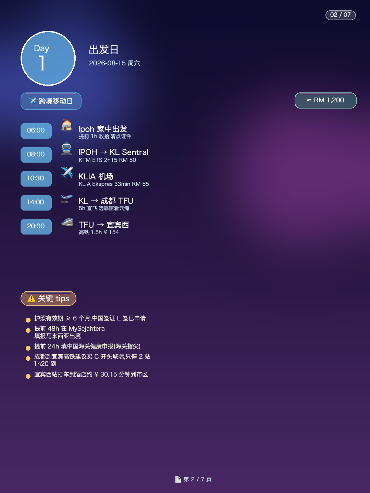
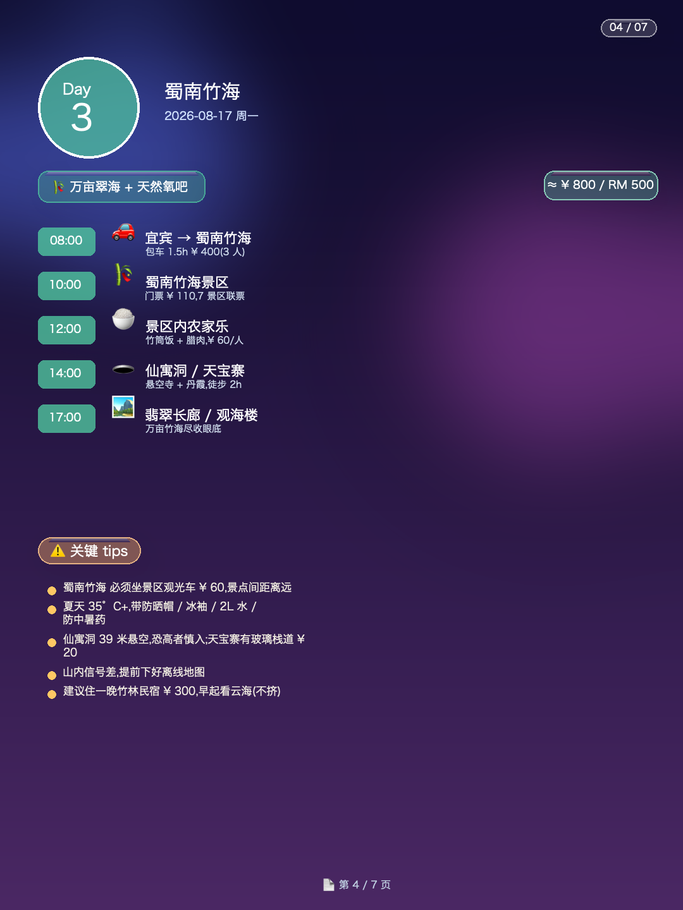
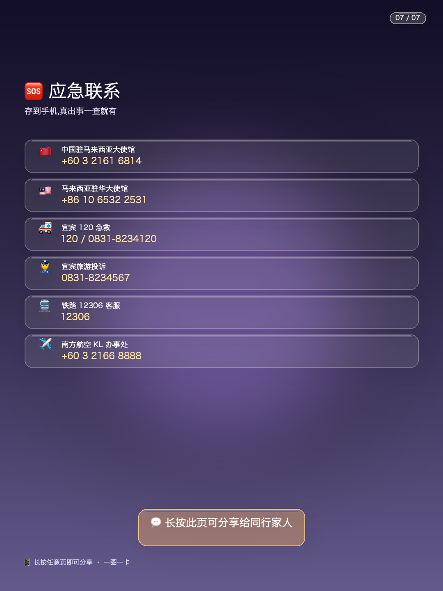
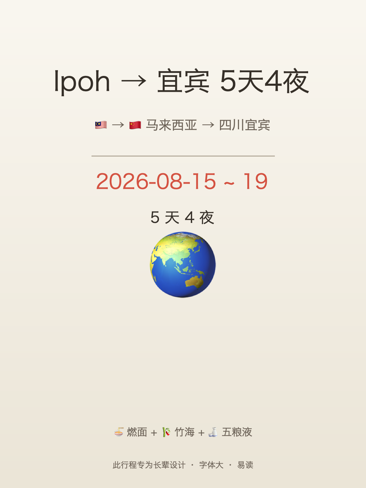
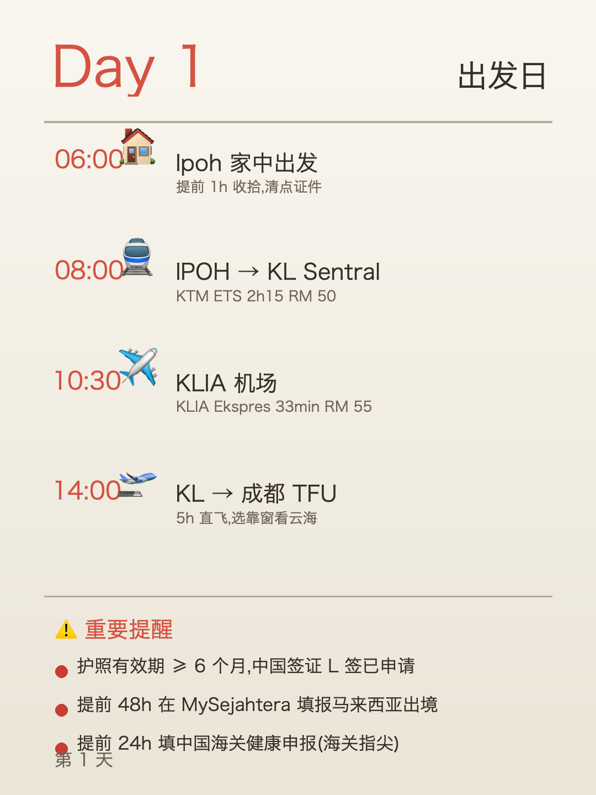

# 🧳 trip-planner

> End-to-end trip planning skill: full itinerary + per-step precautions + 9-category essentials checklist + cost breakdown + mobile-friendly multi-page 3:4 images, generated locally with PIL + Apple Color Emoji.

[](LICENSE)
[](https://www.python.org)
[](https://github.com/openai/codex)

---

## ✨ 1 句话调用

> 任何 thread 里说 **"做一张玻璃拟态 + 等距 3D + 软 3D UI 风格的信息图"** 或 **"用 Glassmorphism + Isometric + Soft 3D 风格出图"**,本 skill 自动接管。

也支持:
- "用上次那个小红书风格做一张"
- "用 Glass + Iso + Soft 3D 出【主题】"

---

## 📦 这是什么

从用户一句"去 X 玩 N 天"开始,**全自动**产出一套可直接打包带走的旅行手册:

| 交付物 | 形式 | 文件 |
|---|---|---|
| 1. **行程图** | 单张长截图 PNG(玻璃拟态) | `itinerary_long.png` |
| 2. **3:4 多页故事卡** | 7 张 1080×1440 PNG,逐张分享 | `01_cover.png` ... `07_back.png` |
| 3. **每步 ⚠️ 注意事项** | 3-5 条 actionable tips | 嵌入上述图 |
| 4. **9 大类必备清单** | Markdown checkbox | `essentials.md` |
| 5. **成本拆解** | Markdown 表格 + 省钱技巧 | `cost_breakdown.md` |
| 6. **手机日历** | 标准 .ics | `calendar.ics` |

---

## 🚀 一键安装

### 方式 A:从 GitHub 安装(推荐)

```bash
# 把 <owner/repo> 替换成你的 GitHub 仓库名
/Users/a1234/.codex/skills/.system/skill-installer/scripts/install-skill-from-github.py \
  --repo <owner/repo> \
  --path trip-planner
```

### 方式 B:本地拷贝(没有 GitHub 时)

```bash
cp -R /path/to/trip-planner-github \
      ~/.codex/skills/trip-planner
```

### 方式 C:软链(开发中常用)

```bash
ln -s /path/to/trip-planner-github \
      ~/.codex/skills/trip-planner
```

✅ 装好后,任何 thread 里说"做行程规划"或"用 Glassmorphism 风格出图",系统自动激活。

---

## 🎬 效果预览

### 玻璃拟态 3:4 故事卡(年轻人 / 小红书 / 朋友圈)

| Day 1 出发 | Day 3 蜀南竹海 | 🆘 应急联系 |
|:---:|:---:|:---:|
|  |  |  |

(完整 7 张见 `screenshots/` 目录)

### 老人大字版(长辈 / 视障 / 朗读)

| 封面 | Day 1 |
|:---:|:---:|
|  |  |

- 标题 80pt,正文 36pt
- 米白底 + 砖红强调,高对比
- 一页一重点,无装饰干扰
- 朗读友好(适合 TTS / 屏幕朗读)

完整 8 张见 `examples/` 或自己跑 `python scripts/render_elder.py trip.json outdir`

---

## 🛠️ 自己用(本地 Python)

```bash
# 1. 准备 trip JSON(参考 examples/trip-yibin-5day.json)
cp examples/trip-yibin-5day.json /tmp/my-trip.json

# 2. 改目的地/日期/事件后,跑 3:4 多页生成器
PY=/Library/Frameworks/Python.framework/Versions/3.14/bin/python3.14
$PY scripts/render_story.py /tmp/my-trip.json /tmp/output

# 3. 输出在 /tmp/output/,每页 1080×1440 PNG
ls /tmp/output/
# 01_cover.png  02_day1.png  ...  07_back.png
```

**支持完整 Apple Color Emoji**(macOS 原生彩色),无需任何外部 API key,沙盒内即可出图。

---

## 📂 仓库结构

```
trip-planner/
├── SKILL.md                            # 触发语 / 工作流(本 skill 入口)
├── README.md                           # 你正在看的
├── LICENSE                             # MIT
├── .gitignore
├── references/
│   ├── essentials-checklist.md         # 9 大类 80+ 项清单模板
│   ├── question-templates.md           # 6 类行程提问模板
│   ├── style-prompts.md                # Glassmorphism 风格 prompt 库
│   └── output-formats.md               # 5 种手机友好输出形式
├── scripts/
│   ├── render_mobile.py                # 单张长截图生成器(PIL + Emoji)
│   ├── render_story.py                 # 3:4 多页故事卡生成器(主推)
│   └── make_ics.py                     # .ics 日历生成器
├── examples/
│   ├── trip-yibin-5day.json            # 完整示例数据(Ipoh→宜宾 5D4N)
│   └── README.md                       # 复跑说明
└── screenshots/                        # 效果预览图
    ├── 01_cover.png
    ├── 02_day1.png
    ├── 03_day2.png
    ├── 04_day3.png
    ├── 05_day4.png
    ├── 06_day5.png
    └── 07_back.png
```

---

## 🎨 风格系统

| 关键词 | 视觉 |
|---|---|
| **Glassmorphism** | 玻璃拟态(透明卡 + 描边 + 柔光) |
| **Isometric** | 30° 等距投影 3D |
| **Soft 3D UI** | Apple Vision Pro 风圆角 3D |
| **Apple Color Emoji** | macOS 原生彩色 emoji 替代手画图标 |
| **Macaron Palette** | 紫 / 薄荷 / 桃 / 奶油 |

5 套调色板:`purple`(默认) / `coral` / `teal` / `lavender` / `warm`

---

## 🧠 自动适配规则

按行程类型智能增项:

| 行程类型 | 增项 | 信息图侧重点 |
|---|---|---|
| **学校探校** | 简历 5 份 + 成绩单 + 获奖证书 + 信用卡额度 | 学校等距建筑 + 录取门槛 |
| **家庭度假** | 儿童药品 + 防晒 + 雨具 + 零食 | 地标 + 餐厅 |
| **商务出差** | 名片 + 西装 + 充电宝 + 备用证件 | 会议地点 + 客户公司 |
| **蜜月** | 戒指 + 相机 + 情侣装 | 浪漫氛围 + 酒店 |
| **高原 / 雪山** | 红景天 + 厚羽绒 + 抗高反 | 雪山 + 装备 |
| **海岛** | 泳衣 + 浮潜 + 防水袋 | 海滩 + 浮潜 |

按目的地气候调整衣物类(热带 / 温带 / 寒带 / 高原)。

按目的地电源插头自动查表(中国 A/C · 马来新 G · 欧洲 C/E/F · 美 A/B · 澳 I ...)。

---

## 📱 输出格式

| 格式 | 工具 | 适合 |
|---|---|---|
| 单张长截图(1080×11000) | `render_mobile.py` | 桌面 / 投影 |
| **3:4 多页 1080×1440** | `render_story.py` | **手机 / 小红书 / 朋友圈(主推)** |
| Markdown 行程 | 模板 | Notion / 邮件 |
| 必备清单 | 模板 | 打印 / Checklist APP |
| 成本拆解 | 模板 | 预算 / 报销 |
| .ics 日历 | `make_ics.py` | 导入手机日历 |

---

## 🔧 依赖

- Python 3.10+(开发用 3.14)
- PIL(`pip install pillow`)
- macOS + `Apple Color Emoji` 字体(预装)
- 不需要任何 API key

---

## 📊 已知限制

- Apple Color Emoji 仅 macOS 渲染正常(Linux 可改用 Noto Color Emoji 路径)
- CJK 文字用 NSBitmapImageRep 渲染,沙盒外 Linux 上需 pyqt5 + 字体

---

## 📜 License

[MIT](LICENSE) © 2026 trip-planner contributors
